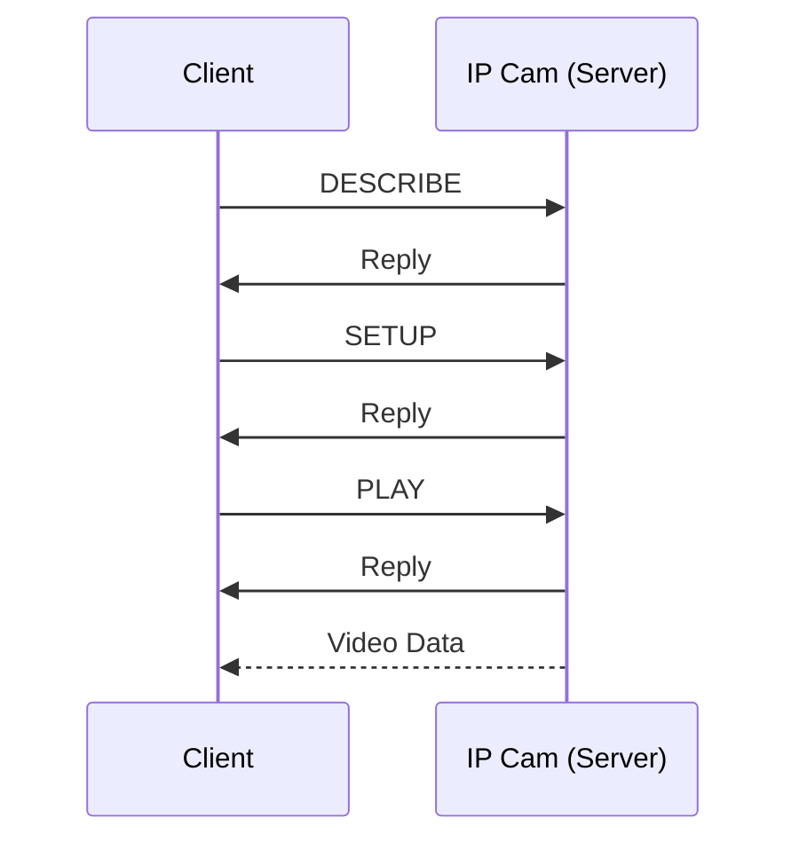

# Wireshark dump
There's a lot of info in the Wireshark dump, so the first thing to do is to filter the **address** to my IP cam's IP so we only see what it sends/receives.

![[Pasted image 20240325233243.png]]

We can see there's some sort of ping-pong going on at first.



The protocol tab of wireshark informs us that this comms is [RTSP 1.0](https://datatracker.ietf.org/doc/html/rfc2326).

>**Note:** This capture was done by running the [retina](https://github.com/scottlamb/retina) crate, which is what I'm contributing to. It only supports `RTSP 1.0` which is why we're going to be looking at RFC 2326, not RFC 7826 which is `RTSP 2.0`.

# Looking at RTSP comms
## [DESCRIBE](https://datatracker.ietf.org/doc/html/rfc2326#section-10.2)

Nothing too special about this packet except the fact that we're asking to receive the content in `application/sdp`.

## [SETUP](https://datatracker.ietf.org/doc/html/rfc2326#section-10.4)

Interesting to note that `retina` has hard-coded the `Transport` option as
```
RTP/AVP/TCP;unicast;interleaved={proposed_channel_id}-{proposed_channel_id + 1}
```

## [PLAY](https://datatracker.ietf.org/doc/html/rfc2326#section-10.5)

The interesting part here is sending `npt=0.000-`, which I guess means start playing video immediately (`0.000`) & continuously (`-`).

# Analyzing the first RTP payload
Once the camera replies to the `PLAY` request, it starts sending out video data i.e. H.264 inside RTP packets. We can now filter wireshark capture by setting `ip.src_host == {camera_ip}` so we see one-way comms from IP camera to my system, and inspect the RTP payload.
## [H.264 video in RTP packets](https://datatracker.ietf.org/doc/html/rfc6184)

We can use RFC 6184 to understand what the payload of the RTP packets will be.

From [Section 5.2](https://datatracker.ietf.org/doc/html/rfc6184#section-5.2):
>A receiver can identify the payload structure by the first byte of the RTP packet payload

and also,
>This byte is always structured as a NAL unit header.  The NAL unit type field indicates which structure is present.

The first byte of the RTP payload will tell us what type of payload structure it is. Read [Section 5.2](https://datatracker.ietf.org/doc/html/rfc6184#section-5.2) to understand the three types of payload structures.
## RTP payload
Here's the first few bytes

```
0000   3c 87 4d 00 1f e7 40 28 02 dd 80 a5 05 05 05 f0
0010   00 00 03 00 10 00 00 03 02 8b 01 00 02 dc 68 00
0020   02 25 51 7f ff 02 80 00 00 00 01 28 ee 3c 80 00
0030   00 00 01 25 b8 40 00 10 5b fc 84 a5 08 ec d2 43
0040   b6 58 0b ec 17 2e 74 65 73 80 73 90 8b d5 7a f5
0050   9e ea 8c 8e 55 09 80 cf 50 19 4b 8a 08 ac 2f 3c
```

## First byte of RTP payload

As mentioned in the RFC, we'll analyze the first byte (`0x00`) which is `3c`.

`3c` in binary is `00111100`.

The RFC told us that this is always structured as a NAL unit header, which is defined in [Section 1.3](https://datatracker.ietf.org/doc/html/rfc6184#section-1.3) as:

```
+---------------+
|0|1|2|3|4|5|6|7|
+-+-+-+-+-+-+-+-+
|F|NRI|  Type   |
+---------------+
```

The first byte represented as a NAL unit header.
```
+---------------+
|0|0|1|1|1|1|0|0|
+-+-+-+-+-+-+-+-+
|F|NRI|  Type   |
+---------------+
```

### Payload structure identification

We're interested in the **Type** value, which is `11100`. This in decimal is `28`, which is, acc. to Table 1 of [Section 5.2](https://datatracker.ietf.org/doc/html/rfc6184#section-5.2), a [**FU-A**](https://datatracker.ietf.org/doc/html/rfc6184#section-5.8) packet.

## Second byte of RTP payload

Now we know that the first RTP packet is of type **FU-A**, we can look at its doc to move forward.
The format is defined in Figure 14 as:
```
0                   1                   2                   3
0 1 2 3 4 5 6 7 8 9 0 1 2 3 4 5 6 7 8 9 0 1 2 3 4 5 6 7 8 9 0 1
+-+-+-+-+-+-+-+-+-+-+-+-+-+-+-+-+-+-+-+-+-+-+-+-+-+-+-+-+-+-+-+-+
| FU indicator  |   FU header   |                               |
+-+-+-+-+-+-+-+-+-+-+-+-+-+-+-+-+                               |
|                                                               |
|                         FU payload                            |
|                                                               |
|                               +-+-+-+-+-+-+-+-+-+-+-+-+-+-+-+-+
|                               :...OPTIONAL RTP padding        |
+-+-+-+-+-+-+-+-+-+-+-+-+-+-+-+-+-+-+-+-+-+-+-+-+-+-+-+-+-+-+-+-+
```

One key point of FU-A packets:
> Fragmentation is defined only for a single NAL unit and not for any aggregation packets.

Meaning a FU-A packet (which can consist of multiple packets i.e. fragmented) can contain data of only a **single** NAL unit, not multiple.

**^ Remember that.**

Now, we've already read the first byte, which is the **FU indicator**, let's read the second byte i.e. **FU header**.

The second byte (`0x01`) is `87`, which in binary is `10000111`.

Format of FU header:
```
+---------------+
|0|1|2|3|4|5|6|7|
+-+-+-+-+-+-+-+-+
|S|E|R|  Type   |
+---------------+

S (start bit)
E (end bit)
R (reserved bit)
Type (NALU payload type) <-- interest
```

Our second byte as FU header is:
```
+---------------+
|1|0|0|0|0|1|1|1|
+-+-+-+-+-+-+-+-+
|S|E|R|  Type   |
+---------------+
```

**Since it is the first fragment of FU-A, the start bit is `1`, and the NAL payload type is `00111`, which in decimal is `7`.**

The NAL unit type of [`7` is for **SPS**](NAL%20unit%20type%20code).

Now we know the following:
- The packet is a FU-A packet
- The FU-A packet has the header of SPS, meaning the data after FU header is supposed to be entirely for SPS

Let's start reading the packet further.

## Reading next bytes

### [Emulation Prevention Bytes (EPBs)](Emulation%20Prevention)
There are emulation prevention bytes (EPBs) at byte `0x12` and `0x17`.

### [Start code](Annex%20B)
There is a start code at `0x27` till `0x2a` i.e. `0x00_00_00_01`.

### Next NALU (PPS header & data)
At `0x2b`, we get the header of next NALU `0x28`, or `00101000`, where **type** of NALU is `01000`, [which is `8` i.e. `PPS`](NAL%20unit%20type%20code). Subsequent bytes are PPS data.

### [Start code](Annex%20B)
There is a start code at `0x2f` till `0x32` i.e. `0x00_00_00_01`.

### Next NALU header (IDR header & data)
At `0x33` is next NALU header `25`, or `00100101`, where type of NALU is `00101`, [which is `5` for IDR](NAL%20unit%20type%20code). Subsequent bytes are IDR data.
## How FU-As should be

Notice that the FU-A packets are fragmented. And remember when I quoted the RFC which explicitly said that:
> Fragmentation is defined only for a single NAL unit and not for any aggregation packets.

This means that when we have received a FU-A packet i.e. we receive all fragmented packets for that FU-A, starting from the first packet with **start bit** set to `1`, until the final packet with **end bit** set to `1`, will be of a **single NALU**.

```
FU-A example

[3c 87 ...] # first fragmented packet of FU-A
[3c 07 ...], [3c 07 ..], .. , [3c 07] # middle fragmented packets
[3c 47 ...] # last fragmented packet of FU-A
```

The payload of the entire FU-A packet should be of a **single NALU**, which is made clear by the last digit in second byte `7`, meaning these packets were for `SPS`.

## What our FU-A is

So we know what the payload of the FU-A should be, i.e. data for `SPS`.

**However**

We've received an **Annex B** stream in the FU-A packet, which contains `SPS`, `PPS` and `IDR` slice.

Normally, IDR slices are big so they're commonly sent over FU-A packets, but my camera is bundling up `SPS` & `PPS` with the `IDR slice` into an **Annex B** stream, and sending **that** through FU-A, which acc. to the RFC, ain't what we was supposed to do dawg.

This is essentially what we're receiving.
```
[
3c           # FU-A
87           # start of FU-A for SPS
..           # SPS data
(start code) # end of last NALU
28           # single NALU for PPS
..           # PPS data
(start code) # end of last NALU
25           # single NALU for IDR
..           # IDR data
]

[
3c           # FU-A
07           # middle packets of FU-A for SPS
..           # IDR data
]

[
3c           # FU-A
47           # end of FU-A for SPS
..           # IDR data
]
```

Funny how the FU-A fragments after the first one still say that they'll have `SPS`, but they instead have `IDR slice` since that's the last NALU in the Annex B stream.

## Conclusion

The camera is not conforming to the RFC, which is why `retina` isn't able to work. I'll need to come up with a solution for parsing the Annex B stream in FU-A packets so `retina` works with my camera.

**Spoiler alert:** I did make a PR before but the code didn't feel good, which is why I'm gonna attempt doing it again.

**Update:** Opened up a [PR](https://github.com/scottlamb/retina/pull/100) for adding support for my camera.