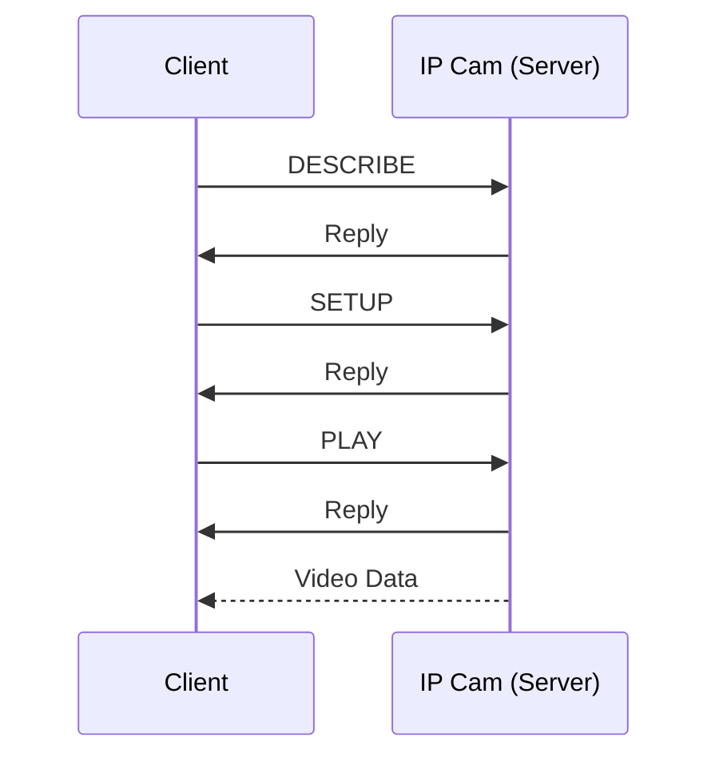

There's a lot of info in the Wireshark dump, so the first thing to do is to filter the **address** to my IP cam's IP so we only see what it sends/receives.

![[Pasted image 20240325233243.png]]

We can see there's some sort of ping-pong going on at first.



The protocol tab of wireshark informs us that this comms is [RTSP 1.0](https://datatracker.ietf.org/doc/html/rfc2326).

>**Note:** This capture was done by running the [retina](https://github.com/scottlamb/retina) crate, which is what I'm contributing to. It only supports `RTSP 1.0` which is why we're going to be looking at RFC 2326, not RFC 7826 which is `RTSP 2.0`.

## [DESCRIBE](https://datatracker.ietf.org/doc/html/rfc2326#section-10.2)

Nothing too special about this packet except the fact that we're asking to receive the content in `application/sdp`.

## [SETUP](https://datatracker.ietf.org/doc/html/rfc2326#section-10.4)

Interesting to note that `retina` has hard-coded the `Transport` option as
```
RTP/AVP/TCP;unicast;interleaved={proposed_channel_id}-{proposed_channel_id + 1}
```

## [PLAY](https://datatracker.ietf.org/doc/html/rfc2326#section-10.5)

The interesting part here is sending `npt=0.000-`, which I guess means start playing video immediately (`0.000`) & continuously (`-`).

> I remember seeing a **teardown** process when exiting the program. Does playing with `npt=0.000-` and then crashing the program without teardown affect the camera in any way? Probably not I guess?